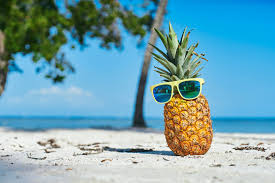
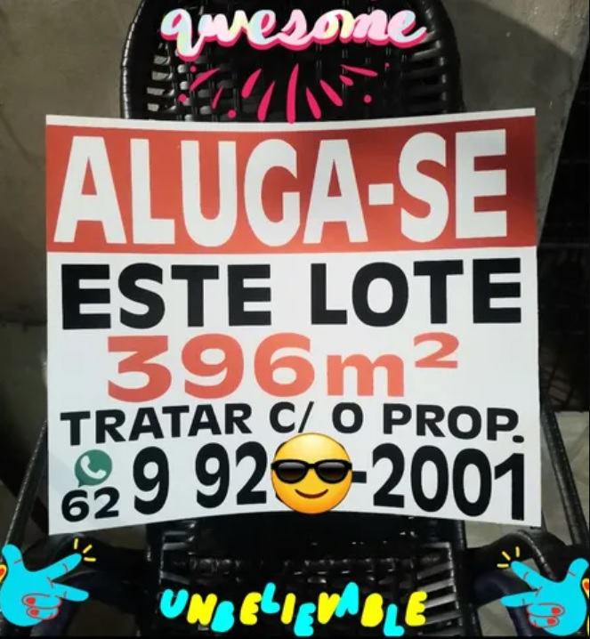

# azure-ai-service-vision-studio-demo

## Escolha o Idioma / Choose Language
- [English](#Introduction)
- [Português](#Introdução)

### English Version

## Introduction
We tested some of the related services in Azure Vision Studio. Some images were used to generate the result according to the tables shown in each functionality test.

## FACE

Detect the location of one or more human faces in images, along with attributes such as pose, facial mask, and facial landmarks.

| Image                                      | Result                                 | JSON                                    |
|---------------------------------------------|-----------------------------------------------|-----------------------------------------------|
|          | [Attributes detected](Output/detectedAtributesImage1.txt)         | [JSON](Output/detectedAtributesImage1.json)         |
|          | [Attributes detected](Output/detectedAtributesImage2.txt)         | [JSON](Output/detectedAtributesImage2.json)         |
|          | [Attributes detected](Output/detectedAtributesImage3.txt)         | [JSON](Output/detectedAtributesImage3.json)         |

## Image Analysis - Add captions to images

Generate a readable sentence that describes the content of an image.

| Image                                      | Result                                  | JSON                                    |
|---------------------------------------------|-----------------------------------------------|-----------------------------------------------|
|          | [Attributes detected](Output/detectedAtributesImage4.txt)         | [JSON](Output/detectedAtributesImage4.json)         |
|          | [Attributes detected](Output/detectedAtributesImage5.txt)         | [JSON](Output/detectedAtributesImage5.json)         |
|          | [Attributes detected](Output/detectedAtributesImage6.txt)         | [JSON](Output/detectedAtributesImage6.json)         |

## OCR (Optical Character Recognition)

Use the Read API to extract printed and handwritten text in supported languages from images, PDFs, and TIFF files. The optical character recognition (OCR) capability supports both images and documents with mixed languages, and doesn't require specifying the language.

| Image                                      | Result                                  | JSON                                    |
|---------------------------------------------|-----------------------------------------------|-----------------------------------------------|
|          | [Attributes detected](Output/detectedAtributesImage7.txt)         | [JSON](Output/detectedAtributesImage7.json)         |
|          | [Attributes detected](Output/detectedAtributesImage8.txt)         | [JSON](Output/detectedAtributesImage8.json)         |
|          | [Attributes detected](Output/detectedAtributesImage9.txt)         | [JSON](Output/detectedAtributesImage9.json)         |

## References

[Detect faces in Vision Studio](https://microsoftlearning.github.io/mslearn-ai-fundamentals/Instructions/Labs/04-face.html)

[Read text in Vision Studio](https://microsoftlearning.github.io/mslearn-ai-fundamentals/Instructions/Labs/05-ocr.html)

[Analyze images in Vision Studio](https://microsoftlearning.github.io/mslearn-ai-fundamentals/Instructions/Labs/03-image-analysis.html)

### Versão em Português

## Introdução
Foram testados alguns dos serviços relacionados no Azure Vision Studio. Algumas imagens foram utilizadas para gerar o resultado conforme as tabelas mostradas em cada teste de funcionalidade.

## FACE

Detecte a localização de um ou mais rostos humanos em imagens, juntamente com atributos como pose, máscara facial e pontos de referência faciais.

| Imagem                                      | Resultado                                 | JSON                                    |
|---------------------------------------------|-----------------------------------------------|-----------------------------------------------|
|          | [Atributos Detectados](Output/detectedAtributesImage1.txt)         | [JSON](Output/detectedAtributesImage1.json)         |
|          | [Atributos Detectados](Output/detectedAtributesImage2.txt)         | [JSON](Output/detectedAtributesImage2.json)         |
|          | [Atributos Detectados](Output/detectedAtributesImage3.txt)         | [JSON](Output/detectedAtributesImage3.json)         |

## Análise de Imagem - Adicione legendas às imagens

Gere uma frase legível que descreva o conteúdo de uma imagem.

| Imagem                                      | Resultado                                  | JSON                                    |
|---------------------------------------------|-----------------------------------------------|-----------------------------------------------|
|          | [Atributos Detectados](Output/detectedAtributesImage4.txt)         | [JSON](Output/detectedAtributesImage4.json)         |
|          | [Atributos Detectados](Output/detectedAtributesImage5.txt)         | [JSON](Output/detectedAtributesImage5.json)         |
|          | [Atributos Detectados](Output/detectedAtributesImage6.txt)         | [JSON](Output/detectedAtributesImage6.json)         |

## OCR (Reconhecimento Optico de Caracteres)

Use a API Read para extrair texto impresso e manuscrito em idiomas suportados de imagens, PDFs e arquivos TIFF. O recurso de reconhecimento óptico de caracteres (OCR) oferece suporte a imagens e documentos com idiomas mistos e não exige a especificação do idioma.

| Imagem                                      | Resultado                                  | JSON                                    |
|---------------------------------------------|-----------------------------------------------|-----------------------------------------------|
|          | [Atributos Detectados](Output/detectedAtributesImage7.txt)         | [JSON](Output/detectedAtributesImage7.json)         |
|          | [Atributos Detectados](Output/detectedAtributesImage8.txt)         | [JSON](Output/detectedAtributesImage8.json)         |
|          | [Atributos Detectados](Output/detectedAtributesImage9.txt)         | [JSON](Output/detectedAtributesImage9.json)         |

## Referências

[Detect faces in Vision Studio](https://microsoftlearning.github.io/mslearn-ai-fundamentals/Instructions/Labs/04-face.html)

[Read text in Vision Studio](https://microsoftlearning.github.io/mslearn-ai-fundamentals/Instructions/Labs/05-ocr.html)

[Analyze images in Vision Studio](https://microsoftlearning.github.io/mslearn-ai-fundamentals/Instructions/Labs/03-image-analysis.html)
