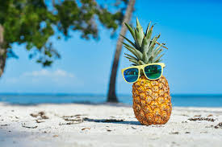

[English](README.md)[Português](#Introdução)
_______________________________________________________________________________________________________________________________________
## Introdução
Foram testados alguns dos serviços relacionados no Azure Vision Studio. Algumas imagens foram utilizadas para gerar o resultado conforme as tabelas mostradas em cada teste de funcionalidade.

## FACE

Detecte a localização de um ou mais rostos humanos em imagens, juntamente com atributos como pose, máscara facial e pontos de referência faciais.

| Imagem                                      | Resultado                                 | JSON                                    |
|---------------------------------------------|-----------------------------------------------|-----------------------------------------------|
|          | [Atributos Detectados](Output/detectedAtributesImage1.txt)         | [JSON](Output/detectedAtributesImage1.json)         |
|          | [Atributos Detectados](Output/detectedAtributesImage2.txt)         | [JSON](Output/detectedAtributesImage2.json)         |
|          | [Atributos Detectados](Output/detectedAtributesImage3.txt)         | [JSON](Output/detectedAtributesImage3.json)         |

## Análise de Imagem - Adicione legendas às imagens

Gere uma frase legível que descreva o conteúdo de uma imagem.

| Imagem                                      | Resultado                                  | JSON                                    |
|---------------------------------------------|-----------------------------------------------|-----------------------------------------------|
|          | [Atributos Detectados](Output/detectedAtributesImage4.txt)         | [JSON](Output/detectedAtributesImage4.json)         |
|          | [Atributos Detectados](Output/detectedAtributesImage5.txt)         | [JSON](Output/detectedAtributesImage5.json)         |
|          | [Atributos Detectados](Output/detectedAtributesImage6.txt)         | [JSON](Output/detectedAtributesImage6.json)         |

## OCR (Reconhecimento Optico de Caracteres)

Use a API Read para extrair texto impresso e manuscrito em idiomas suportados de imagens, PDFs e arquivos TIFF. O recurso de reconhecimento óptico de caracteres (OCR) oferece suporte a imagens e documentos com idiomas mistos e não exige a especificação do idioma.

| Imagem                                      | Resultado                                  | JSON                                    |
|---------------------------------------------|-----------------------------------------------|-----------------------------------------------|
|          | [Atributos Detectados](Output/detectedAtributesImage7.txt)         | [JSON](Output/detectedAtributesImage7.json)         |
|          | [Atributos Detectados](Output/detectedAtributesImage8.txt)         | [JSON](Output/detectedAtributesImage8.json)         |
|          | [Atributos Detectados](Output/detectedAtributesImage9.txt)         | [JSON](Output/detectedAtributesImage9.json)         |

## Referências

[Detect faces in Vision Studio](https://microsoftlearning.github.io/mslearn-ai-fundamentals/Instructions/Labs/04-face.html)

[Read text in Vision Studio](https://microsoftlearning.github.io/mslearn-ai-fundamentals/Instructions/Labs/05-ocr.html)

[Analyze images in Vision Studio](https://microsoftlearning.github.io/mslearn-ai-fundamentals/Instructions/Labs/03-image-analysis.html)
